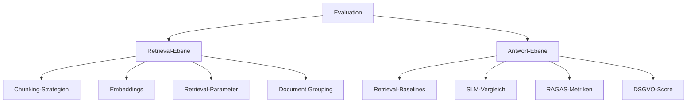

# Evaluation

## Überblick


---

## Ordnerstruktur

```text
src/rag/
    retrieval_grid_search.py   # Retrieval-Experimente
    llm_grid_search.py         # Modell-Experimente
    evaluator.py               # zentrale Evaluierungslogik

configs/
    000_baseline*.yaml         # Baseline-Konfigurationen

results/
    runs/retrieval/            # Einzel-Runs Retrieval
    runs/llm/                  # Einzel-Runs LLM
    tables/retrieval/          # aggregierte Tabellen Retrieval
    tables/llm/                # aggregierte Tabellen LLM
    retrieval_results_table.py # Aggregation Retrieval
    llm_results_table.py       # Aggregation LLM
```
---

## Retrieval-Ebene

### Konfiguration
- Baseline-Konfiguration als Ausgangspunkt  
- Variabel:  
  - Chunking-Strategie (z. B. fixed-size, recursive, semantic)  
  - Chunk-Größe (nur für bestimmte Strategien)  
  - Anzahl zurückgelieferter Dokumente (`top_k`)  
  - Ähnlichkeitsschwelle (`similarity_threshold`)  
  - Gruppierung aktiviert oder deaktiviert  

### Durchführung

```bash
cd src/rag
python retrieval_grid_search.py
```

### Aggregation

```bash
cd results
python retrieval_results_table.py
```
---

## Antwort-Ebene

### Konfiguration
- Zwei Baselines (konservativ, erweitert)  
- Variabel:  
  - Sprachmodelle (`LLM_MODELS` in llm_grid_search.py)  
  - Optional: Temperaturen (`OPTIONAL_TEMPS`)  

### Durchführung

```bash
cd src/rag
python llm_grid_search.py
```

### Aggregation

```bash
cd results
python llm_results_table.py
```
---

## Ergebnisse

- Retrieval-Tabellen: IR-Metriken für die getesteten Konfigurationen  
- LLM-Tabellen: RAGAS-Metriken und DSGVO-Score  
- Ausgabe: CSV + Markdown  
---

## Hinweise

- `.env` muss API- und ggf. Ollama-Parameter enthalten  
- Modellnamen müssen zur lokalen Umgebung passen  
- Ergebnisse werden mit Zeitstempeln gespeichert  
- Cache kann bei Bedarf geleert werden  
---

## Beispiel: evaluation_summary

```json
{
  "avg_precision": 0.21,
  "avg_recall": 0.15,
  "avg_f1": 0.16,
  "avg_query_time": 3.75,
  "avg_response_length": 957,
  "avg_faithfulness": 0.41,
  "avg_answer_relevance": 0.11,
  "avg_context_relevance": 0.26,
  "avg_dsgvo_score": 0.29,
  "pipeline_info": {
    "llm": {"model": "gpt-4o-mini", "temperature": 0.1, "max_tokens": 1000},
    "embedding": {"model": "all-MiniLM-L6-v2", "provider": "sentence-transformers"},
    "chunking": {"type": "fixedsize", "chunk_size": 1200, "chunk_overlap": 180},
    "retrieval": {"method": "vector-similarity", "top_k": 3, "similarity_threshold": 0.0}
  },
  "context_optimization": {"truncation_rate": 0.0, "avg_context_utilization": 0.21},
  "evaluation_info": {"enabled_evaluators": ["PrecisionRecallEvaluator","TimingEvaluator","RAGASEvaluator"]}
}
```

---

## Parameterquellen & Überschreibungen

### Übersicht (Quelle der Wahrheit)

| Komponente | Parameter (Beispiel) | Baseline-Config (`configs/*.yaml`) | Überschrieben durch Grid-Script | Verhalten zur Laufzeit |
|---|---|---|---|---|
| **Chunking** | `chunking.type` | ✓ | Retrieval-Grid (`retrieval_grid_search.py`) | Für jede Kombination wird ein Temp‑YAML erzeugt und an den Evaluator übergeben. |
|  | `chunking.chunk_size` | ✓ | Retrieval-Grid | Wird nur für bestimmte Strategien gesetzt (z. B. fixed‑size/recursive). |
|  | `chunking.chunk_overlap` | ✓ | Retrieval-Grid | Bei fixed‑size/recursive automatisch als 15 % von `chunk_size` neu berechnet. |
| **Retrieval** | `retrieval.top_k` | ✓ | Retrieval-Grid | Pro Run gesetzt. |
|  | `retrieval.similarity_threshold` | ✓ | Retrieval-Grid | Pro Run gesetzt. |
| **Dataset** | `dataset.grouping.enabled` | ✓ | Retrieval-Grid | Pro Run gesetzt (aktiviert/deaktiviert). |
|  | `dataset.evaluation_subset_size` | ✓ | – | Wird vom Evaluator gelesen; kann als `num_qa` übergeben werden. |
| **Embedding** | `embedding.*` (z. B. Modell, Gerät) | ✓ | – | In beiden Grids konstant gemäß Baseline. |
| **LLM** | `llm.model` | ✓ | LLM-Grid (`llm_grid_search.py`) | Pro Run aus `LLM_MODELS` gesetzt. |
|  | `llm.abbr` | ✓ | LLM-Grid (optional) | Wird zur Benennung genutzt; wenn nicht gesetzt, bleibt YAML‑Wert. |
|  | `llm.temperature` | ✓ | LLM-Grid (optional) | Standard: Wert aus Baseline. Varianten über `OPTIONAL_TEMPS`. |
|  | `llm.max_tokens` | ✓ | – | Konstant gemäß Baseline. |
| **Pipeline** | `pipeline.max_context_length`, `include_context` | ✓ | – | Konstant gemäß Baseline. |

### Skriptlogik (Kurzbeschreibung)

- **Retrieval‑Grid** (`src/rag/retrieval_grid_search.py`):  
  Lädt eine Baseline‑YAML, erzeugt pro Parameterkombination eine temporäre Konfiguration und führt einen Run aus. Der Ergebnis‑Speicherort ist `results/runs/retrieval/`. Die Experimentnamen werden aus Chunking‑Typ, Größe (falls relevant), `top_k`, Schwelle und Embedding‑Abkürzung gebildet.  

- **LLM‑Grid** (`src/rag/llm_grid_search.py`):  
  Lädt zwei Baselines (konservativ/erweitert). Pro Baseline werden die in `LLM_MODELS` definierten Modelle (und optional Temperaturen) getestet. Der Ergebnis‑Speicherort ist `results/runs/llm/`. Die Experimentnamen enthalten die LLM‑Abkürzung und die Baseline‑Bezeichnung.  

### Baseline vs. Variation

- **Baseline**  
  - Retrieval‑Ebene: Alle konstanten Einstellungen (Embedding, Pipeline‑Grenzen, unveränderte Chunking/ Retrieval‑Defaults) stammen aus der Baseline‑YAML.  
  - Antwort‑Ebene: Jede der beiden Baselines definiert den Fixzustand der Pipeline; Abweichungen pro Run betreffen nur das LLM (und optional die Temperatur).  

- **Variationen**  
  - Retrieval‑Ebene: Nur die im Grid definierten Parameter werden pro Run verändert (z. B. Chunking‑Strategie/‑Größe, `top_k`, Ähnlichkeitsschwelle, Gruppierung).  
  - Antwort‑Ebene: Nur die LLM‑Auswahl (und optional die Temperatur) wird pro Run verändert; alle übrigen Parameter bleiben identisch zur jeweiligen Baseline.  

---

## Benennung & Ausgabeorte

- **Experimentnamen (Retrieval)**: enthalten Chunking‑Typ, ggf. Chunk‑Größe, `top_k`, Schwelle und Embedding‑Abkürzung.  
- **Experimentnamen (LLM)**: enthalten LLM‑Abkürzung und Baseline‑Label; bei Temperatur‑Varianten ein Temperatursuffix.  
- **Ablage**: Detail‑ und Summary‑JSONs werden in den jeweiligen `results/runs/...`‑Unterordnern gespeichert; Tabellen werden in `results/tables/...` erzeugt.  


---

## Umgebungsvariablen

Die Datei `.env` muss vor Ausführung der Grid-Skripte vorhanden sein.  
Ein Beispiel ist in `.env.example` enthalten.  

### Varianten
- **OpenAI-Nutzung**: `OPENAI_API_KEY` setzen und `OPENAI_BASE_URL=https://api.openai.com/v1`.  
- **Ollama-Nutzung**: `OPENAI_BASE_URL=http://localhost:11434/v1` und `OPENAI_API_KEY=ollama` (Dummy) setzen.   
