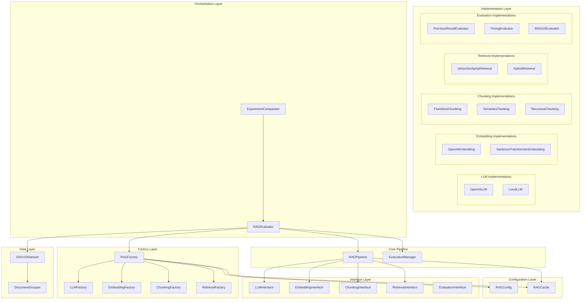
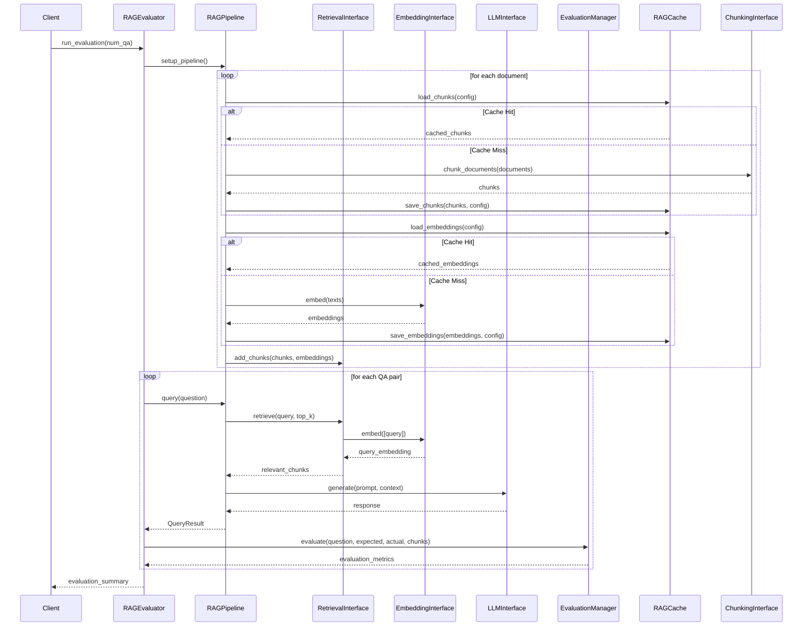

# Diagramme

## Komponenten

```mermaid
graph TB
    subgraph "Configuration Layer"
        Config[RAGConfig]
        Cache[RAGCache]
    end

    subgraph "Factory Layer"
        MainFactory[RAGFactory]
        LLMFact[LLMFactory]
        EmbedFact[EmbeddingFactory]
        ChunkFact[ChunkingFactory]
        RetrFact[RetrievalFactory]
    end

    subgraph "Interface Layer"
        LLMInt[LLMInterface]
        EmbedInt[EmbeddingInterface]
        ChunkInt[ChunkingInterface]
        RetrInt[RetrievalInterface]
        EvalInt[EvaluationInterface]
    end

    subgraph "Implementation Layer"
        subgraph "LLM Implementations"
            OpenAILLM[OpenAILLM]
            LocalLLM[LocalLLM]
        end

        subgraph "Embedding Implementations"
            OpenAIEmbed[OpenAIEmbedding]
            STEmbed[SentenceTransformersEmbedding]
        end

        subgraph "Chunking Implementations"
            FixedChunk[FixedSizeChunking]
            SemanticChunk[SemanticChunking]
            RecursiveChunk[RecursiveChunking]
        end

        subgraph "Retrieval Implementations"
            VectorRetr[VectorSimilarityRetrieval]
            HybridRetr[HybridRetrieval]
        end

        subgraph "Evaluation Implementations"
            PrecisionEval[PrecisionRecallEvaluator]
            TimingEval[TimingEvaluator]
            RAGASEval[RAGASEvaluator]
        end
    end

    subgraph "Core Pipeline"
        Pipeline[RAGPipeline]
        EvalManager[EvaluationManager]
    end

    subgraph "Orchestration Layer"
        RAGEval[RAGEvaluator]
        ExpComp[ExperimentComparator]
    end

    subgraph "Data Layer"
        Dataset[DSGVODataset]
        DocGrouper[DocumentGrouper]
    end

    %% Dependencies
    MainFactory --> Config
    MainFactory --> Cache
    MainFactory --> LLMFact
    MainFactory --> EmbedFact
    MainFactory --> ChunkFact
    MainFactory --> RetrFact

    Pipeline --> LLMInt
    Pipeline --> EmbedInt
    Pipeline --> ChunkInt
    Pipeline --> RetrInt
    Pipeline --> Cache

    RAGEval --> MainFactory
    RAGEval --> Pipeline
    RAGEval --> EvalManager
    RAGEval --> Dataset

    ExpComp --> RAGEval

    Dataset --> DocGrouper
```

## Klassendiagramm

```mermaid
classDiagram
    %% Abstract Interfaces
    class LLMInterface {
        <<interface>>
        +generate(prompt: str, context: str) str
        +get_model_info() Dict
    }

    class EmbeddingInterface {
        <<interface>>
        +embed(texts: List[str]) List[List[float]]
        +get_model_info() Dict
    }

    class ChunkingInterface {
        <<interface>>
        +chunk(text: str, metadata: Dict) List[Chunk]
        +get_chunking_info() Dict
    }

    class RetrievalInterface {
        <<interface>>
        +add_chunks(chunks: List[Chunk]) None
        +set_embedding_model(model: EmbeddingInterface) None
        +retrieve(query: str, top_k: int) List[Chunk]
        +get_retrieval_info() Dict
    }

    class EvaluationInterface {
        <<interface>>
        +evaluate(query: str, ground_truth: str, response: str, chunks: List[Chunk]) Dict
        +get_metric_info() Dict
    }

    %% Data Classes
    class Chunk {
        +id: str
        +text: str
        +metadata: Dict
        +embedding: Optional[List[float]]
    }

    class QueryResult {
        +query: str
        +chunks: List[Chunk]
        +response: str
        +metadata: Dict
    }

    %% Configuration Management
    class RAGConfig {
        -config_path: Path
        -config: Dict
        +get_llm_config() Dict
        +get_embedding_config() Dict
        +get_chunking_config() Dict
        +get_retrieval_config() Dict
        +validate_config() bool
    }

    %% Factory Pattern
    class RAGFactory {
        -config: RAGConfig
        -experiment_name: str
        -cache: RAGCache
        +create_pipeline() RAGPipeline
        +create_evaluator() EvaluationManager
        +get_cache_info() Dict
    }

    class LLMFactory {
        <<factory>>
        +create_llm(config: Dict) LLMInterface
    }

    class EmbeddingFactory {
        <<factory>>
        +create_embedding(config: Dict) EmbeddingInterface
    }

    class ChunkingFactory {
        <<factory>>
        +create_chunking(config: Dict) ChunkingInterface
    }

    class RetrievalFactory {
        <<factory>>
        +create_retrieval(config: Dict) RetrievalInterface
    }

    %% Concrete Implementations - LLMs
    class OpenAILLM {
        -client: OpenAI
        -model: str
        -temperature: float
        +generate(prompt: str, context: str) str
        +get_model_info() Dict
    }

    class LocalLLM {
        -model_name: str
        -endpoint: str
        -api_type: str
        +generate(prompt: str, context: str) str
        +_generate_ollama(prompt: str) str
        +_test_connection() None
    }

    %% Concrete Implementations - Embeddings
    class OpenAIEmbedding {
        -client: OpenAI
        -model: str
        +embed(texts: List[str]) List[List[float]]
        +get_model_info() Dict
    }

    class SentenceTransformersEmbedding {
        -model: SentenceTransformer
        -model_name: str
        -device: str
        +embed(texts: List[str]) List[List[float]]
        +get_model_info() Dict
    }

    %% Concrete Implementations - Chunking
    class FixedSizeChunking {
        -chunk_size: int
        -chunk_overlap: int
        -separator: str
        +chunk_documents(documents: List[Dict]) List[Chunk]
        +chunk(text: str, metadata: Dict, start_id: int) List[Chunk]
    }

    class SemanticChunking {
        -min_chunk_size: int
        -max_chunk_size: int
        -separator: str
        +chunk_documents(documents: List[Dict]) List[Chunk]
        +chunk(text: str, metadata: Dict, start_id: int) List[Chunk]
    }

    class RecursiveChunking {
        -chunk_size: int
        -chunk_overlap: int
        -separators: List[str]
        +chunk_documents(documents: List[Dict]) List[Chunk]
        +_split_text(text: str) List[str]
    }

    %% Concrete Implementations - Retrieval
    class VectorSimilarityRetrieval {
        -top_k: int
        -similarity_threshold: float
        -chunks: List[Chunk]
        -embeddings_array: np.ndarray
        -_embedding_model: EmbeddingInterface
        +add_chunks(chunks: List[Chunk], embeddings: List[List[float]]) None
        +retrieve(query: str, top_k: int) List[Chunk]
        +_calculate_cosine_similarities(query_embedding: np.ndarray) np.ndarray
    }

    class HybridRetrieval {
        -vector_weight: float
        -keyword_weight: float
        -top_k: int
        +retrieve(query: str, top_k: int) List[Chunk]
        +_get_vector_scores(query: str) np.ndarray
        +_get_keyword_scores(query: str) np.ndarray
    }

    %% Evaluation Components
    class PrecisionRecallEvaluator {
        +evaluate(...) Dict
        +_word_overlap_metrics(expected: str, actual: str) Dict
        +_sequence_similarity(expected: str, actual: str) float
        +_semantic_similarity(expected: str, actual: str) float
    }

    class TimingEvaluator {
        +evaluate(...) Dict
        +_estimate_tokens(text: str) int
    }

    class RAGASEvaluator {
        +evaluate(...) Dict
        +_calculate_faithfulness(answer: str, chunks: List[Chunk]) float
        +_calculate_answer_relevance(question: str, answer: str) float
        +_calculate_context_relevance(question: str, chunks: List[Chunk]) float
    }

    class EvaluationManager {
        -evaluators: List[EvaluationInterface]
        +evaluate(...) Dict
        +get_evaluation_info() Dict
    }

    %% Core Pipeline
    class RAGPipeline {
        -llm: LLMInterface
        -embedding: EmbeddingInterface
        -chunking: ChunkingInterface
        -retrieval: RetrievalInterface
        -cache: RAGCache
        -is_indexed: bool
        +index_documents(documents: List[Dict]) None
        +query(question: str, top_k: int) QueryResult
        +_get_or_create_chunks(documents: List[Dict]) List[Chunk]
        +_get_or_create_embeddings(chunks: List[Chunk]) List[List[float]]
    }

    %% Caching System
    class RAGCache {
        -experiment_name: str
        -cache_dir: Path
        +save_embeddings(embeddings: List[List[float]], config: Dict) None
        +load_embeddings(config: Dict) Optional[List[List[float]]]
        +save_chunks(chunks: List[Chunk], config: Dict) None
        +load_chunks(config: Dict) Optional[List[Chunk]]
        +_get_config_hash(config: Dict) str
    }

    %% Dataset Management
    class DSGVODataset {
        -data_path: Path
        -documents: List[Dict]
        -qa_pairs: List[Dict]
        +get_documents() List[Dict]
        +get_qa_pairs() List[Dict]
        +get_evaluation_subset(num_qa: int) List[Dict]
        +_generate_qa_pairs() None
    }

    %% Main Orchestrators
    class RAGEvaluator {
        -factory: RAGFactory
        -dataset: DSGVODataset
        -pipeline: RAGPipeline
        -evaluator: EvaluationManager
        -experiment_name: str
        +setup_pipeline() None
        +run_evaluation(num_qa: int, save_results: bool) Dict
        +_calculate_summary(results: List[Dict], total_time: float) Dict
    }

    class ExperimentComparator {
        -configs: List[str]
        -dataset_path: str
        -results: Dict
        -comparison_data: List[Dict]
        +run_all_experiments(num_qa: int) Dict
        +generate_comparison_report() str
        +save_comparison_results() None
    }

    %% Relationships
    LLMInterface <|-- OpenAILLM
    LLMInterface <|-- LocalLLM
    EmbeddingInterface <|-- OpenAIEmbedding
    EmbeddingInterface <|-- SentenceTransformersEmbedding
    ChunkingInterface <|-- FixedSizeChunking
    ChunkingInterface <|-- SemanticChunking
    ChunkingInterface <|-- RecursiveChunking
    RetrievalInterface <|-- VectorSimilarityRetrieval
    RetrievalInterface <|-- HybridRetrieval
    EvaluationInterface <|-- PrecisionRecallEvaluator
    EvaluationInterface <|-- TimingEvaluator
    EvaluationInterface <|-- RAGASEvaluator

    RAGFactory --> RAGConfig
    RAGFactory --> RAGCache
    RAGFactory --> LLMFactory
    RAGFactory --> EmbeddingFactory
    RAGFactory --> ChunkingFactory
    RAGFactory --> RetrievalFactory

    RAGPipeline --> LLMInterface
    RAGPipeline --> EmbeddingInterface
    RAGPipeline --> ChunkingInterface
    RAGPipeline --> RetrievalInterface
    RAGPipeline --> RAGCache
    RAGPipeline --> Chunk
    RAGPipeline --> QueryResult

    EvaluationManager --> EvaluationInterface

    RAGEvaluator --> RAGFactory
    RAGEvaluator --> DSGVODataset
    RAGEvaluator --> RAGPipeline
    RAGEvaluator --> EvaluationManager

    ExperimentComparator --> RAGEvaluator

    VectorSimilarityRetrieval --> EmbeddingInterface
    HybridRetrieval --> EmbeddingInterface
```

## Sequenzdiagramm

```mermaid
sequenceDiagram
    participant Client
    participant RAGEvaluator
    participant RAGPipeline
    participant RetrievalInterface
    participant EmbeddingInterface
    participant LLMInterface
    participant EvaluationManager
    participant RAGCache

    Client->>RAGEvaluator: run_evaluation(num_qa)
    RAGEvaluator->>RAGPipeline: setup_pipeline()

    loop for each document
        RAGPipeline->>RAGCache: load_chunks(config)
        alt Cache Hit
            RAGCache-->>RAGPipeline: cached_chunks
        else Cache Miss
            RAGPipeline->>ChunkingInterface: chunk_documents(documents)
            ChunkingInterface-->>RAGPipeline: chunks
            RAGPipeline->>RAGCache: save_chunks(chunks, config)
        end

        RAGPipeline->>RAGCache: load_embeddings(config)
        alt Cache Hit
            RAGCache-->>RAGPipeline: cached_embeddings
        else Cache Miss
            RAGPipeline->>EmbeddingInterface: embed(texts)
            EmbeddingInterface-->>RAGPipeline: embeddings
            RAGPipeline->>RAGCache: save_embeddings(embeddings, config)
        end

        RAGPipeline->>RetrievalInterface: add_chunks(chunks, embeddings)
    end

    loop for each QA pair
        RAGEvaluator->>RAGPipeline: query(question)
        RAGPipeline->>RetrievalInterface: retrieve(query, top_k)
        RetrievalInterface->>EmbeddingInterface: embed([query])
        EmbeddingInterface-->>RetrievalInterface: query_embedding
        RetrievalInterface-->>RAGPipeline: relevant_chunks
        RAGPipeline->>LLMInterface: generate(prompt, context)
        LLMInterface-->>RAGPipeline: response
        RAGPipeline-->>RAGEvaluator: QueryResult

        RAGEvaluator->>EvaluationManager: evaluate(question, expected, actual, chunks)
        EvaluationManager-->>RAGEvaluator: evaluation_metrics
    end

    RAGEvaluator-->>Client: evaluation_summary
```

##